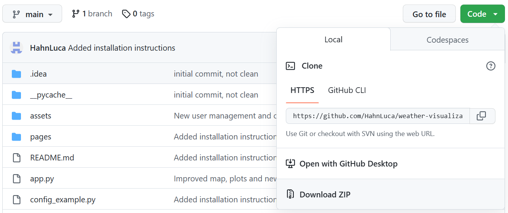
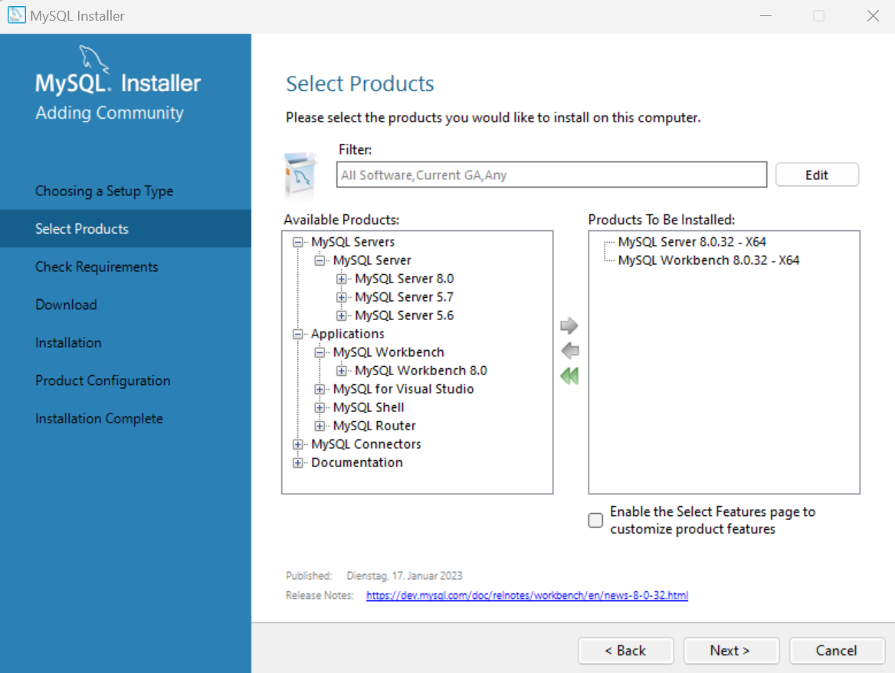
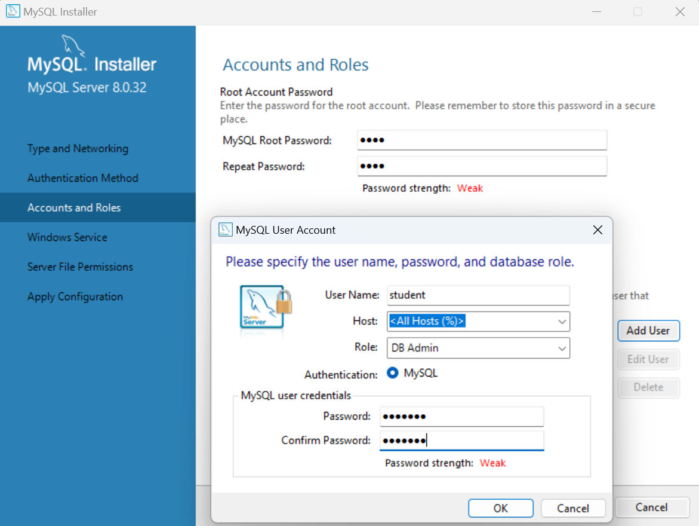
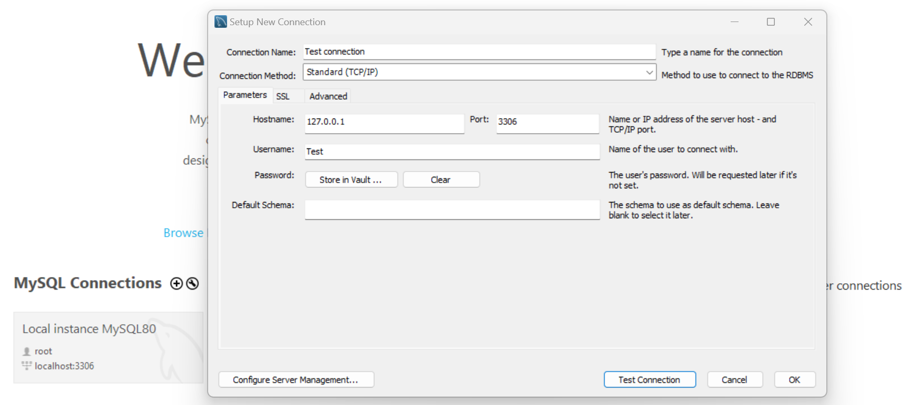

# Studienarbeit an der HS Mannheim

"Webbasierte Visualisierung von Umweltmessdaten mit Python und MQTT"

## Installationsanleitung

In den nachfolgenden Abschnitten wird in Kürze erläutert wie die Software unter Windows auszuführen ist.

### Erforderliche Software

1. Installieren Sie die neueste Version von Python 3 über den folgenden Link:
   https://www.python.org/downloads/. Wählen Sie hierbei die Checkbox **Add python.exe to PATH** aus
2. Laden Sie das Projekt als ZIP Ordner aus GitHub über den folgenden Link herunter und entpacken Sie es:
   https://github.com/HahnLuca/weather-visualization  

      

3. Öffnen Sie die Windows-Eingabeaufforderung und navigieren Sie in den soeben heruntergeladenen Ordner.
4. Um nun alle benötigten Module zu installieren, führen Sie folgenden Befehl aus: 
   ```pip install -r requirements.txt``` Dies kann einige Minuten dauern.

### MySQL Download und Setup

Im MySQL Installer können größtenteils die Default-Einstellungen verwendet werden.

1. Laden Sie den ersten MySQL Community Installer über den folgenden Link herunter:
   https://dev.mysql.com/downloads/installer/
2. Die Aufforderung zur Erstellung eines Oracle Web Accounts kann übersprungen werden.
3. Öffnen Sie den Installer, sobald dieser heruntergladen wurde.
4. Im Abschnitt "Choosing a Setup Type" reicht es "Custom" auszuwählen, da nur der "MySQL Server" und
   die "MySQL Workbench" für die Verwendung der Software notwendig sind.
5. Daraufhin können die neuesten Versionen des bereits erwähnten "MySQL Servers" und der "MySQL Workbench"
   unter "Select Products" ausgewählt und hinzugefügt werden.  

      

6. In den nächsten Fenstern können die Default-Einstellungen übernommen werden.
7. Bei "Accounts and Roles" muss ein Root Passwort festgelegt werden.
   Außerdem sollte hier ein neuer Benutzer angelegt werden.  

      

8. In den nächsten Fenstern sind wieder die Default-Einstellungen zu übernehmen.
9. Im Anschluss an die Installation öffnen Sie die MySQL Workbench.
10. Hier können Sie über das Plus eine neue "MySQL Connection" anlegen 
    und dabei, den von Ihnen angelegten User verwenden.  

      

11. Über die soeben angelegte Verbindung können Sie sich nun mit dem MySQL Server verbinden.

### Konfigurationen

1. Benennen Sie die Datei config_example.py in config.py um
2. Öffnen Sie die Datei config.py in einem Editor bzw. einer Entwicklungsumgebung Ihrer Wahl.
3. Ersetzen Sie dort nun die beispielhaften Benutzernamen und Passwörter mit den Ihnen bekannten.
4. Speichern Sie die Änderungen und schließen Sie die Datei. 
5. Öffnen Sie erneut die Windows-Eingabeaufforderung und navigieren Sie in das Projekt. 
6. Um nun die Datenbank auf Ihrem MySQL Server anzulegen und diese zu initialisieren
   führen Sie den nachfolgenden Befehl aus: ```python db_init.py```
   Hierbei werden Sie gebeten einen Benutzer anzulegen. Wenn Sie diesen Schritt überspringen, können Sie später 
   nicht auf alle Feature des Dashboards zugreifen und somit auch keine neuen Benutzer anlegen.

### Erste Schritte

1. Das Programm kann nun durch den Befehl: ```python app.py``` 
   oder aus einer Entwicklungsumgebung heraus gestartet werden.
2. Öffnen Sie das Dashboard über den erscheinenden Link.
3. Im Bereich Konfigurieren können Sie nach erfolgreichem Login Ihre erste Wetterstation hinzufügen.


## Versionsdokumentation

Im Folgenden werden Änderungen zwischen den einzelnen Versionen dokumentiert.

### Version 0.4.0 - 20.03.2023

* Entfernen der grafischen Oberfläche in db_init.py
* Hitze-/Frostwarnungen werden in Datenbank geloggt und auf dem topic "station_warnings" gepublished
* Bugfixes

### Version 0.3.0 - 19.03.2023

* Installationsanleitung und requirements.txt wurden hinzugefügt
* db_init.py zur Initialisierung der Datenbank wurde angelegt
* Umgang damit, wenn keine Wetterstationen angelegt wurden, wurde ergänzt

### Version 0.2.0 - 16.03.2023

* Ersetzen der Zugangsdaten durch fiktive Daten
* Automatische Anpassung der Kartenzoomstufe je nach Verteilung der Wetterstationen
* Auswahl der Stationen sowohl über Karte als auch über Dropdown möglich
* Neustrukturierung der MySQL Tabelle "wetterstationen"
    * Stationen werden über ID identifiziert
* Auswahl der Anzeige aller Daten oder nur tagesspezifische Werte (min, mean, max)
* Verbesserte MQTT callback Funtion "on_message"
* Ergänzung neuer Plots für Wind, Regen und Signalstärke

### Version 0.1.0 - 10.03.2023

* Speicherung aller über MQTT empfangenen Nachrichten in stationsspezifischen Tabellen (MySQL)
* Erste Version Dashboard
* Zugriffsbeschränkte "Konfigurieren" Seite
    * Hinzufügen Wetterstationen
    * Registrieren neuer Benutzer
* Login Möglichkeit
    * Benutzerverwaltung in Datenbank
    * Passwörter werden gehashed und nicht als Klartext gespeichert
* Anlegen neuer Wetterstationen
    * Überprüfung, ob Änderungen keine Konflikte auslösen
    * Automatische Generation neuer stationsspezifischer Tabelle in Datenbank
    * Aktualisieren der MQTT Abonnements
    